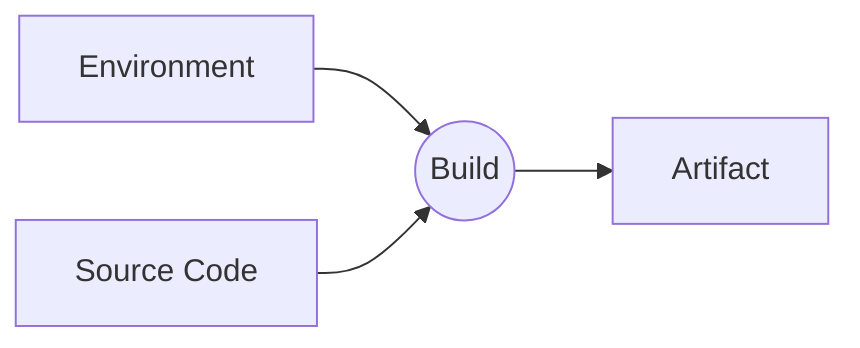

# Design

sver は依存ファイルのバージョンを計算するためのコマンドである。

## 解決したい課題

monorepo 開発における課題の一つとして CI の問題がある。
典型的にはリポジトリ一つに対して CI / CD パイプラインは多くの場合一つになる。
しかしパイプラインが一つであると、リポジトリに変更が入る度にパイプラインが起動し、その変更と関係のないサービスのビルドが実行されてしまい余分に計算リソースや時間を浪費してしまうという事が起きる。

これを避けるために以下の対策が取られることが多い

- 変更による影響を受けるサービスを検知するよう CI/CD Tool の設定を頑張る
- monorepo のためのビルドツールを使う

それぞれの pros, cons は以下の通り。

### CI/CD Tool での解決

**Pros**

- CI の設定で依存関係を設定できる

**Cons**

- 推移的な依存を指定する方法がない
- 検知された変更による判定しかできない
  - 例えば直前のコミットを revert した場合、すでに同じコードに対してビルドされたにもかかわらず再度行われる

### monorepo のためのビルドツールでの解決

**Pros**

- 推移的な依存を見たり、キャッシュの仕組みが組み込まれている
- 特定言語のサポートが手厚い事がある
- ビルド順の制御をおこなうこともできるものもある

**Cons**

- 新たなビルドツールを利用する必要があり、学習コストがかかる
- 既存の言語毎のデファクトスタンダードとなるビルドツールとは別の開発体験になる [^1]
- ビルドツールで対応していない言語がある、あるいはプラグインなどでの対応を行う必要がある [^2]
- 成果物やキャッシュの保存方法について monorepo 専用のビルドツールの流儀に従う必要がある

[^1]: Gradle など、デファクトスタンダードなツールそのものが monorepo に向いた機能を持つこともある。
[^2]: monorepo 用のビルドツールで、多言語を前提としたツールは案外少ない。

参考)
https://www.graat.co.jp/blogs/ck1099bcoeud60830rf0ej0ix
https://monorepo.tools/

### sver での解決

本来やりたいことは「リポジトリに変更を加えたときに、その変更が影響を及ぼすサービスやライブラリだけビルドなどのジョブを実行したい」あるいは「過去にすでに同じコードベースでジョブが行われていればスキップしたい」である。

そして「リポジトリに変更を加えたときに、その変更はこのモジュールに影響を及ぼすか？」を判断するためにはモジュールをビルドするための構成要素に変化がないかを確認できればよい。

sver ではモジュールをビルドするための構成要素から一意のハッシュを計算する仕組みを提供することでこの問題を解決できるようにする。

主要な機能は以下の 2 点。

- バージョンの生成
- 推移的な依存の定義

キャッシュの生成や特定の言語に特化した機能などは提供しない。

## バージョンの生成ロジック

バージョンは、バージョンを計算するための構成要素から計算される sha256 ハッシュの 16 進数表現とする。

バージョンにはショートとロングの 2 種類がある。
ショートバージョンは sha256 の 16 進数表現のうちの前方 12 桁とする。
ロングバージョンは sha256 の 16 進数表現の 64 桁をそのまま使う。

### 構成要素

バージョンを計算するための構成要素は以下の 4 つとする。

- バージョン計算対象の git リポジトリ上のパス
- 依存ファイルの git リポジトリ上のパス
- 依存ファイルの実行権限(git の mode)
- 依存ファイルの内容

### 依存ファイルの導出について

バージョン計算対象がファイルの場合は依存ファイルは指定されたファイルのみとする。
バージョン計算対象がディレクトリの場合はそのディレクトリ配下のファイルすべてとなる。
ただし、そのディレクトリに sver.toml がある場合は以下のようにする
- excludes 指定にマッチするファイルは除外する
- dependencies 指定したディレクトリまたはファイルの依存ファイルは含む

excludes 指定にマッチしたファイルが dependencies 指定のファイルで依存ファイルに含まれる場合は依存ファイルに**含まれる**。

### sver.toml の仕様

sver.toml はトップレベルに profile があり、その配下に dependencies と excludes がある。
現在は default profile のみが使われる。

```toml
[default]
dependencies = [
  "lib/mylib1",
  "lib/mylib2",
]
excludes = [
  "doc",
]
```

## Artifact(成果物)についての考え方

Artifact は、入力となる Source Code と Environment が一致すれば Build が副作用を持たない限り結果は同じ(冪等)になる。



このため、Source Code と Environment を元に一意なハッシュを計算し、それを Artifact のバージョンとすることで同じバージョンの Artifact を何度も Build することが避けられる。
